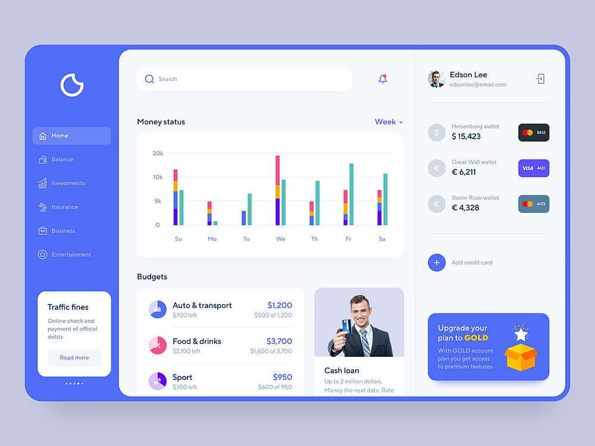
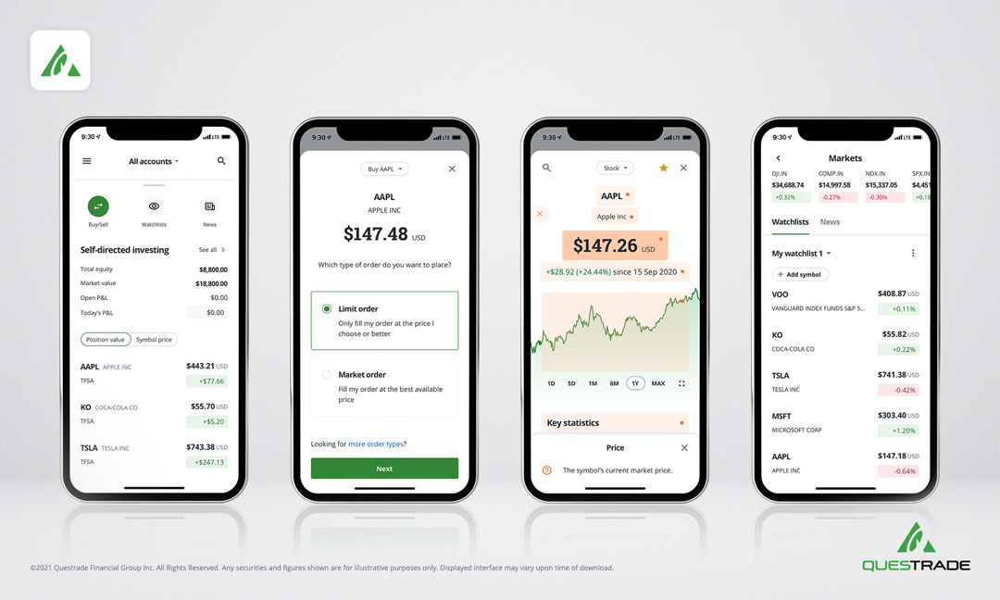
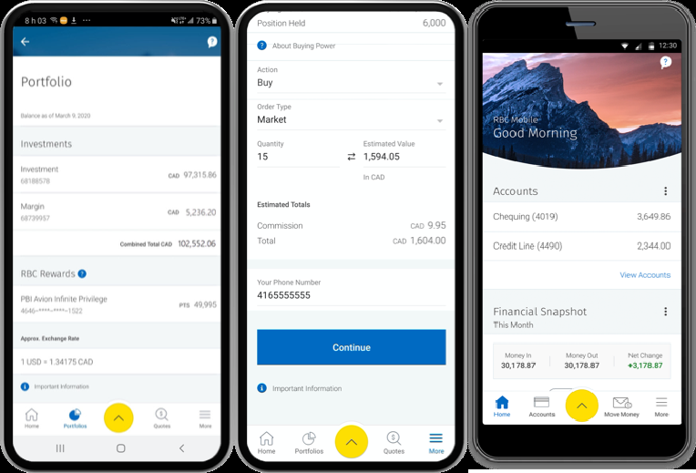
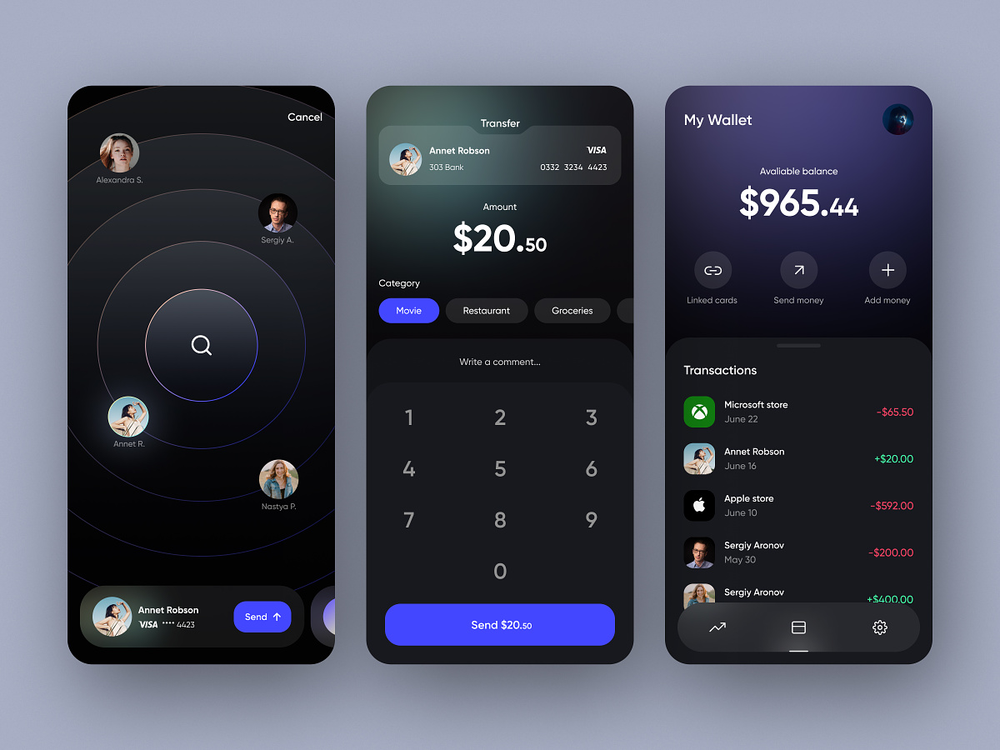

# Case Study: UI Fundamentals Final

## Analysis of mockups and screenshots:
- Apps use colours to denote information at a glance (Green = gains, Red = Loss)
- CoinSave colours on graph not apparent in function (Tooltip?)
- Funda contrasts important information with a larger font.
- Professional apps use a no-nonsense approach to display data. Balance numerical data on right, information on left.
- Dribbble apps use more visual data, but does it add value?
- Organizes transactions by date, assumes user wants to look up most recent transactions.
- Funda only has one balance. This is not reasonable; more likely to have many account balances for different purposes.

## What I want for my own app;
- Use a darker colour scheme to convey importance (i.e. this is a financial app, not a video game), but do not saturate the page with color. Use colour only for focal points and calls-to-action.
- Use a simple display. No need for flashy visuals when all the user wants is the numbers. Use visual graphs only if it adds value.
- Allow for a variety of functions regarding transactions, including cost sharing, cheque depositing, and transferring of money between accounts. Use language that clearly identifies what the function is.
- For investments, relay only the important information; Each share costs x amount, and the value of your share(s) can go up or down daily. You may sell your share(s) for the value of the company today. Also explain different investment plans in easy to understand terms.
- When making investments, I want to see the value of the stock I purchased, compared to its current value. Apps currently show day-to-day changes of stock, which has less value to me. This information might be available, but only on demand.
- The app should be for someone who wants to take control of their finances, but doesn’t know where to start. The app will be a one-stop shop for everything financial, which the user can continue to use indefinitely, or as a stepping stone to more dedicated apps.
- For those that want more advanced features, that might be found in such dedicated apps, a premium plan will be available.
- Most apps use a tab bar at the bottom of the page for navigation, however given the number of functions necessary for the app, a side drawer view might be more appropriate/feasible.

## Important items to have for each section (Ordered by relative importance):
### Transactions
  - Amount paid
  - Recipient/source
  - Date of transaction

### Accounts
  - Current Balance
  - Transactions associated with that account.
  - Associated interest rates for savings/credit accounts.

### Investments
  - Overall gain/loss
  - Daily gain/loss
  - Amount paid for shares, plus shares owned.
  - Type of investment (TFSA, RRSP, etc.)

### Mortgage
  - Monthly Payment, inc. breakdown of costs
  - Price of the Property
  - Down Payment
  - Interest Rate
  - Length of Loan

## Mockups Used
1. CoinSave (Dribbble)
2. Questrade
3. RBC Mobile
4. Funda (Dribbble)
